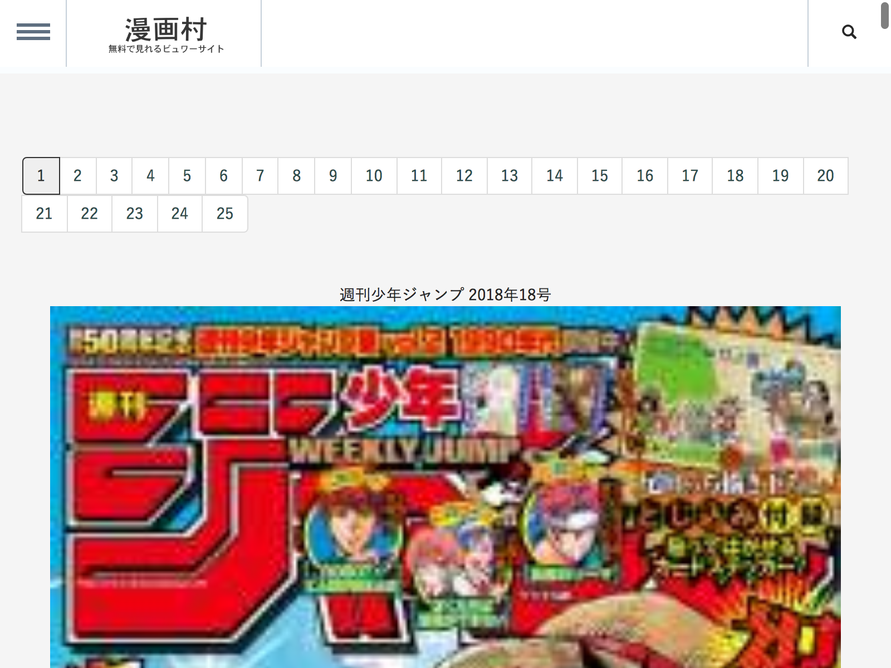

manga-dl
========

とある漫画サイトのダウンローダー

## Usage

```
$ python cli.py [OPTIONS] URL
```

## 課題
+ ヘッドレスモードでクローリング中に、下記のようなreCAPTCHAが出現したとき、どのようにユーザーに入力を求めるか。(参考？ http://scraping.pro/recaptcha-solve-selenium-python/)


+ wgetでのダウンロード時に、クエリパラメータが無視されて保存出来ない。例えば、http://imgon.spimg.ch/v1/ai4032/8.jpg?h=_P-NWnoo76sRun4SfurYZg&t=1080001513007731 をダウンロードしようとしても、http://imgon.spimg.ch/v1/ai4032/8.jpg にリクエストを送って403になっているっぽい
